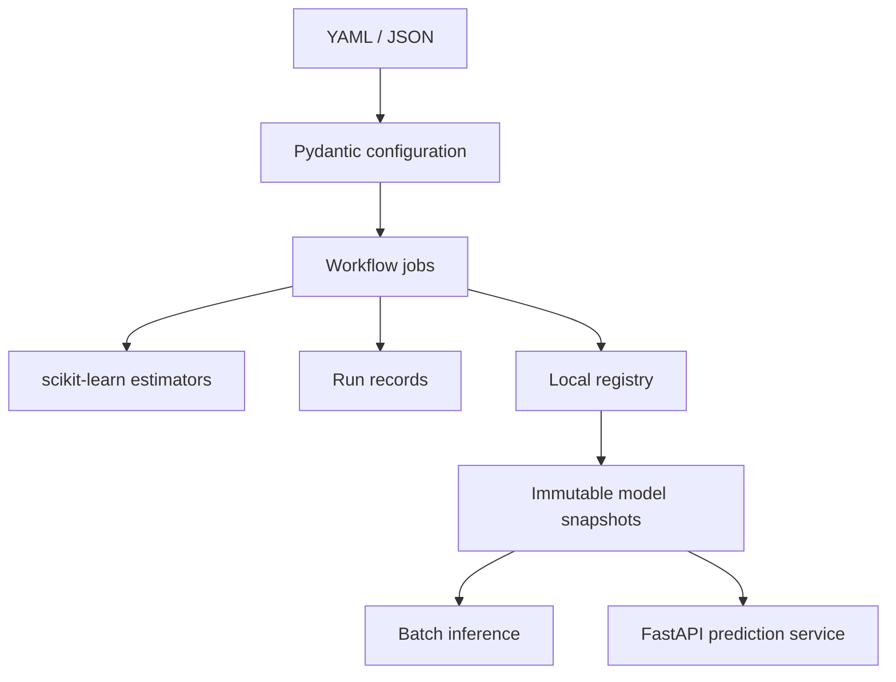

# Architecture

`core` owns models, metrics and configuration/data contracts. `io` owns parsing,
filesystem writes and model resolution. `jobs` coordinates these operations.
The CLI and API expose the same contracts and prediction implementation.

## Reproducibility

Training creates a deterministic train/test split and stratifies it when each
partition can contain every class. Tuning searches only the training partition
with shuffled, seeded cross-validation; the held-out split evaluates the winner.
The example accepts finite numeric features and non-null class labels.

Run metadata includes the resolved configuration, seed, feature order, metrics,
row counts and dataset fingerprint. `poetry.lock` supplies the dependency graph
for development, CI and container builds. Cross-version artifact compatibility
is not guaranteed: train and serve using the same dependency environment.

## Model Versions

Each registration snapshots an artifact into a new version path. A file lock
serializes writers; metadata is written to a temporary file and atomically
replaced. Promotions validate existence, checksum and minimum held-out accuracy.
An alias keeps a stack of earlier targets, allowing successive rollbacks.

The registry is intended for a local filesystem, not distributed coordination.
Filesystem permissions protect model snapshots; SHA-256 detects accidental
modification. Registry metadata currently stores absolute artifact paths, so
move the entire environment consistently or re-register after relocation.

## Serving

The API loads one explicitly configured model at startup. It preserves training
feature order, rejects missing/extra/non-numeric features, and limits prediction
batches to 1,000 rows. Liveness is independent of model readiness. Changing a
registry alias does not hot-reload a running API; restart it to load a new model.

## Extension Points

Add new estimator constructors in `core/models.py`, preprocessing inside a
scikit-learn pipeline, or a managed registry behind the `io` boundary. Replace
local run tracking with a real tracking backend when needed. Preserve the
configuration and prediction contracts and add integration tests for adapters.
