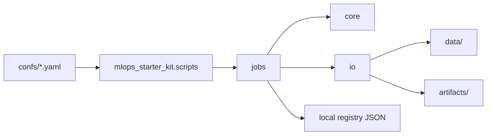

# Architecture

`mlops-starter-kit` is structured as an installable Python package plus a small CLI. The repository is intentionally generic, but its boundaries mirror a production MLOps package:

## Components

| Component | Responsibility |
| --- | --- |
| `core` | Model primitives, metric computation and table validation |
| `io` | Reading configs/data, recording provenance and managing local registry state |
| `jobs` | Executable workflows with service lifecycle hooks |
| `utils` | Search, split and signature helpers used by jobs and downstream projects |
| `confs` | Concrete job definitions for training, evaluation, inference and governance actions |

## Runtime Forms

- `python -m mlops_starter_kit confs/training.yaml` runs a config-driven job.
- `mlops-starter-kit` is exposed as a Poetry script.
- Dockerfiles provide training and serving images.
- `Makefile` and `justfile` expose common local tasks.

## Deliberate Limits

The starter registry is JSON-backed and local. The MLflow service is a small boundary object, not a full tracking server integration. The baseline model is intentionally simple. Replace these pieces with real tracking, model, validation and promotion services once a project has domain data and release requirements.
